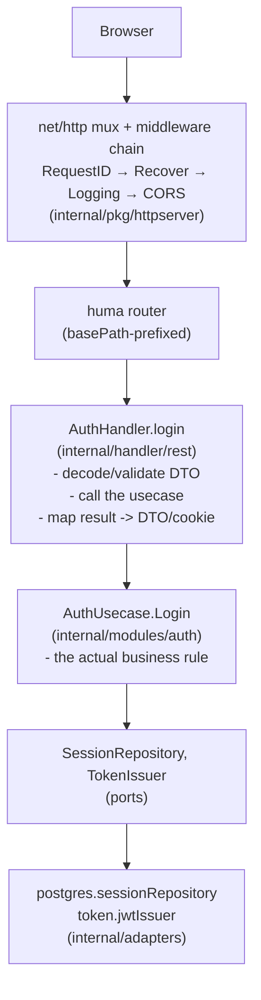

# Architecture

> Living doc: describes current practice, not a mandate. Code and doc disagree? Trust the code, then fix the doc (or don't — nobody's blocked on it). Ask instead of guessing if something's unclear.

This doc assumes you know Go and REST, nothing else. If you've never heard "hexagonal architecture" or "ports and adapters," you're the intended reader.

## The one rule that explains everything

**Business logic never imports infrastructure.** Everything business logic (a "usecase") needs from the outside world — a database, a token signer — it declares as a small Go interface *of its own*. Something else, elsewhere, implements that interface against a real technology. The usecase only ever sees the interface.

That's the entire idea. Everything else in this doc is that one rule applied consistently.

Why bother? Two payoffs:
- **You can test business logic without a database.** Swap the interface for an in-memory fake in a test — no Docker, no network, tests run in milliseconds. See `internal/modules/user/usecase_test.go` for exactly this.
- **You can change infrastructure without touching business logic.** Postgres → something else someday would mean writing a new adapter, not rewriting `Register()`/`Authenticate()`.

## The three layers

```
internal/handler/rest/    "driving" adapter   — HTTP in, translates DTOs <-> domain types
internal/modules/<name>/  the domain          — entities, ports, usecases (the rule lives here)
internal/adapters/        "driven" adapter    — implements the domain's ports against Postgres/JWT/etc.
```

- **`modules/<name>/`** is the domain. It has zero imports of `net/http`, `bun`, `huma`, or any other module's adapter. It defines:
  - an **entity** (a plain Go struct — no ORM tags, no JSON tags)
  - **ports** — interfaces the domain needs (`UserRepository`) or offers (`UserUsecase`)
  - a **usecase** — the struct implementing the "offers" interface, holding business rules
- **`adapters/`** implements the "needs" ports (`UserRepository`, `TokenIssuer`) against real technology. Grouped by *technology*, not by domain — `adapters/postgres/user_repository.go` implements `modules/user`'s port, `adapters/postgres/order_repository.go` implements `modules/order`'s port, all in one `postgres` package, because they share the same bun/Postgres concerns.
- **`handler/rest/`** implements the "offers" side from the outside: it's how an HTTP request turns into a usecase call. It also owns HTTP-only concerns a usecase shouldn't know about — auth/role guards, cookies, request/response DTOs.

**The dependency arrow only points one way**: `adapters/` and `handler/rest/` both import `modules/`. `modules/` never imports either. If you ever find yourself importing `internal/adapters/postgres` from inside `internal/modules/`, that's the rule broken — stop and restructure.

## One request, traced end to end

A `POST /api/v1/auth/login` call:



Cross-cutting, domain-agnostic middleware (request id, logging, panic recovery, CORS) wraps the whole mux in `internal/pkg/httpserver`. Domain-aware middleware (`requireAuth`, `requireRole`) is attached *per-operation* inside `internal/handler/rest`, because unlike the cross-cutting ones, not every route needs it.

## Errors cross the boundary as data, not as HTTP concepts

A usecase returns an `*apperror.Error` (see `internal/pkg/apperror`) — a small `{Code, Message, Cause}` value with codes like `CodeNotFound`, `CodeConflict`, `CodeUnauthorized`. It has no idea what a status code is. Only `internal/handler/rest` (`mapAppError` in `httperror.go`) translates a `Code` into a `huma.StatusError`. This is the same "no infrastructure in the domain" rule applied to error handling specifically — it's what lets `modules/` stay free of `net/http`.

## Two kinds of health check, on purpose

`/livez` and `/readyz` (`internal/pkg/httpserver/health.go`) are registered directly on the raw mux, *unprefixed* and outside huma/OpenAPI — they're infra plumbing (container liveness/readiness probes), not part of the versioned product API:
- `/livez` always returns 200 if the process is running. No dependency checks — a downstream Postgres outage doesn't mean *this process* is unhealthy, and restarting it wouldn't fix a DB outage anyway.
- `/readyz` pings every configured `Pinger` (currently Postgres) and returns 503 if any fail. This is what should gate whether traffic gets routed here.

## Deliberately not here

No CQRS, no event bus, no dependency-injection framework, no repository-per-domain-object micro-abstractions. Wiring is explicit, by hand, in `cmd/cmd_serve.go` — read it top to bottom and you see the entire app's object graph. Adding a layer that isn't paying for itself yet is the opposite of what this codebase is trying to be; see [Adding a Feature](adding-a-feature.md) before reaching for a new pattern.
